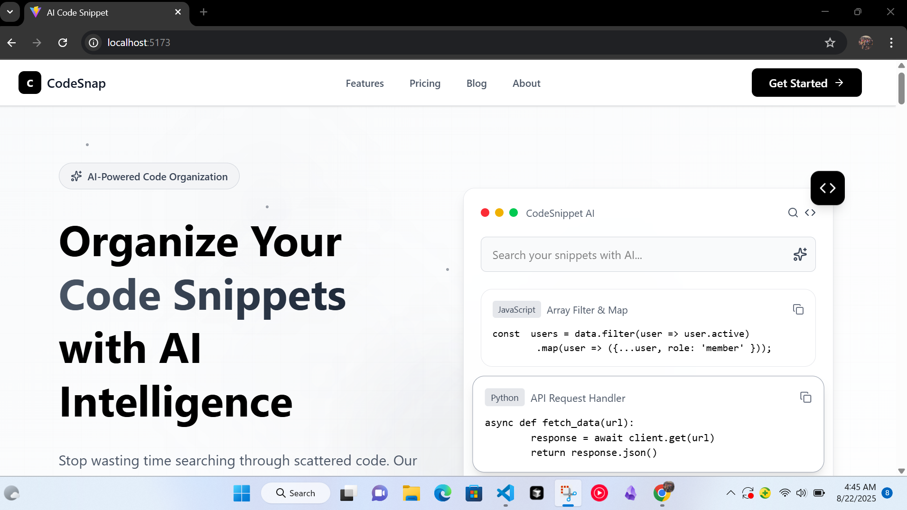

# **AI-Powered Code Snippet Manager**

*A modern web app to store, organize, and enhance code snippets with AI.*

### 💡 Inspired By

This project was inspired by:

* My own frustration with hunting down old code snippets across multiple repos
* Developer tools like [Raycast Snippets](https://raycast.com) and [Carbon](https://carbon.now.sh) for clean code presentation
* The potential of **AI** to make repetitive coding tasks faster and smarter

---

### 📸 Demo

[**Live Demo**](https://ai-code-snippet-manager.vercel.app)



---

## 🚀 Features

* **Store & Organize** code snippets with title, description, and tags
* **AI-Powered** auto-generation of titles, descriptions, and tags
* **Syntax Highlighting** with VS Code Dark+ theme
* **Responsive Design** for mobile, tablet, and desktop
* **Search & Filter** to quickly find snippets

---

## 🛠 Tech Stack

* **Frontend:** React, Next.js 14, Tailwind CSS
* **Code Display:** React Syntax Highlighter, Prettier
* **AI:** Google Gemini API (for content generation)
* **Deployment:** Vercel

---

## 📦 Installation & Setup

```bash
# Clone the repository
git clone https://github.com/fohalabi/ai-code-snippet-manager.git

# Navigate into the project folder
cd ai-code-snippet-manager

# Install dependencies
npm install

# Run development server
npm run dev
```

Open [http://localhost:5173](http://localhost:5173) in your browser.

---

## ⚙️ Environment Variables

Create a `.env.local` file in the root directory and add your API keys:

```env
NEXT_PUBLIC_GEMINI_API_KEY=your_api_key_here
```

---

## 📌 Roadmap

* [ ] User authentication
* [ ] Save snippets to cloud storage
* [ ] Public sharing & community upvotes
* [ ] More AI integrations (bug fixes, code optimization)

---

## 🤝 Contributing

Pull requests are welcome! Please fork the repo and create a feature branch.

---

## 📜 License

MIT License – feel free to use and modify.

---
